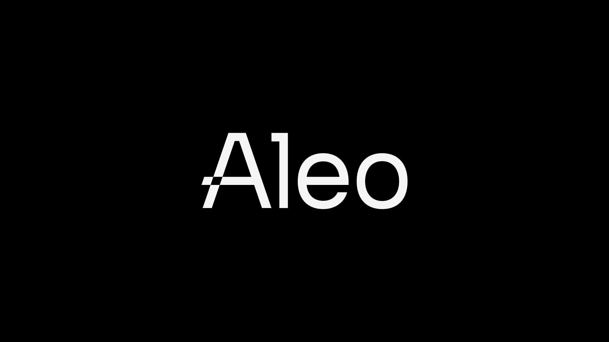

# Public vs. Private State



## Introduction
The concept of Zero Knowledge proofs was first introduced in 1985 in the paper [The Knowledge Complexity of Interactive Proof Systems](https://epubs.siam.org/doi/10.1137/0218012?utm_source=the+new+stack&utm_medium=referral&utm_content=inline-mention&utm_campaign=tns+platform). However, it is only in recent years that the groundbreaking technology has been feasible to be applicable to blockchains. 

Zcash was one of the earliest chains to utilize the power of zero knowledge proofs to provide privacy to an account's balance. Unlike traditional cryptocurrencies like Bitcoin, where transaction details are publicly visible on the blockchain, Zcash enables users to shield their transactions, rendering them completely opaque to outside observers. It utilizes zk-SNARKs (Zero-Knowledge Succinct Non-Interactive Argument of Knowledge), a type of zero-knowledge proof system that allows parties to verify the validity of a computation without revealing the underlying data. 

In even more recent times, we have seen several Ethereum virtual machine-compatible Layer-2 chains that have employed zero-knowledge cryptography techniques to solve Ethereum's scalability issues. Polygon zkEVM, zkSync and Starknet, for example, are ZK rollups which have successfully reduced transaction fees significantly. All of them utilize zero-knowledge technology for scalability reasons.

Aleo is a new layer-1 blockchain that combines general-purpose programmability with privacy by default. Unlike the other chains, Aleo is one of the first blockchains to utilize zero-knowledge for both privacy and scalability. 


## Privacy
There are generally four different types of privacy that relate to blockchains, of which Aleo fulfils the 3 of them:
- [x] Private inputs (messages)
- [x] Private outputs (state changes)
- [x] Private user
- [ ] Private function 

The core belief at Aleo is that privacy is necessary in order for blockchains to have mainstream adoption. For instance, how many of us would be comfortable revealing our bank account numbers if anyone in public were able to trace all the transactions we have ever made? 

## Aleo Storage States 
In order to have privacy native to a chain, Aleo uses a record model for application state storage, which is similar to the UTXO model in Bitcoin. However, Aleo provides developers the option to make application states public should they choose to do so. Public states are stored using the account model as done in Ethereum. 

### Storing Private States via Record
Records are a fundamental data structure that can contain any arbitrary payload and are used for encoding user assets or application states. A record represents a certain state of a program in the global state, for example, the balance of an account or your identity document. 


An Aleo record is serialized in the following format:

| Parameter  |             Type             | Description                                                                                         |
|------------|:----------------------------:|-----------------------------------------------------------------------------------------------------|
|     owner    |            address           |                      The address public key of the owner of the program record                      |
|    data    |    `modifiable`   | A data payload containing arbitrary application-dependent information                               |
|    nonce   |             group            |                            The serial number nonce of the program record                            |

Records are tied to programs deployed on Aleo, and only the owner has permissions to alter the state of the record.

Records are private by default and are stored as ciphertext on-chain.

### Storing Public State via Mapping

A public state in Aleo is stored in the form of a mapping, which are key-value pairs. Anyone is able to query the state of the mapping by querying the Aleo blockchain explorer.

### Switching Between Privacy States
By supporting both private and public storage states, an interesting feature emerges in Aleo where states can be converted from private to public and vice versa.

An example of such a use case would be in a poker game. The state of the shuffled deck after dealing the cards to players should be kept private initially. Proceeding, as the "flop" reveals the top 3 cards, the state of those cards should be revealed to the public.

### View Key
Aleo has a unique feature known as a view key for each account. The view key allows one to decrypt all transactions of it's account. It is different from the private key in that it does not provide the permission to spend the records.

## Private Inputs and Outputs of Programs
Apart from stored program states being private, the program function inputs and outputs can also be made private of public. The following shows an example of an Aleo program which adds two input numbers. As shown, the developer has the choice to specify if the input and output of a program should be public or private.

```
function foo:
    input r0 as field.public;
    input r1 as field.private;
    add r0 r1 into r2;
    output r2 as field.private;
```

## Public vs. Private States

The choice to store an application state as public or private should depend on the particular use case of the program. Instead of simply being a completely privacy or a public chain, Aleo believes in a two pronged approach by offering developers a choice. 

Moreover, real-world applications often rely on a combination of public and private information.

A practical example would be in voting. As stated by the Aleo founder, Howard Wu, "In elections, people want to vote, but they don’t want to show other people how they voted. The tally of the votes needs to be public to understand the outcome. Having private votes and public tallies ends up being a capable functionality in applications here."


## Conclusion
Aleo is one of the very first few layer-1 blockchain that emphasizes on programmable privacy. Developers are able to choose if they wish to make certain states of their program public or private. This opens up a whole new set of interesting applications that cannot be built easily with other blockchains. This is certainly an exciting chain to keep an eye out for.

