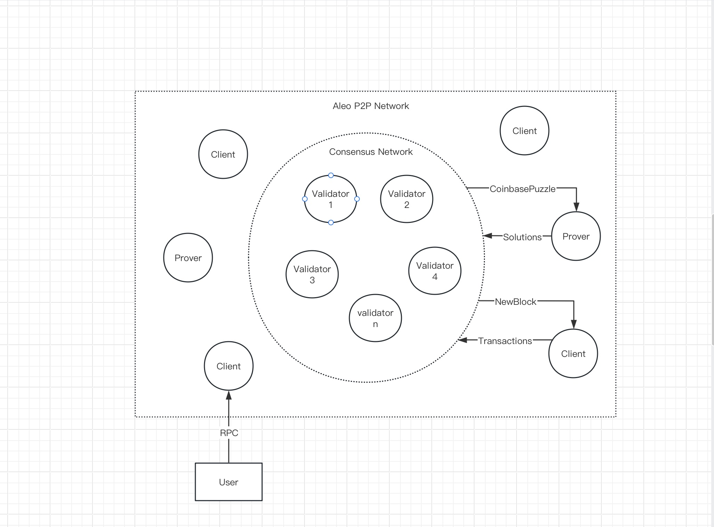

在Aleo中存在着两个网络：一个是共识网络、一个是P2P网络。有三种节点类型：Validator、Prover、Client。

### Validator

Validator会加入到两个网络中，一个是共识网络，通常监听5000端口，另一个是P2P网络，通常监听4130端口。Validator之间会通过5000端口互相连接，形成一个共识网络，Client和Prover不被允许连接共识网络。

Validator节点的主要职责，是按照AleoBFT的规则产生新的块。

在Aleo P2P Network中，除了Client 和 Prover之间会通过P2P互相连接之外，Client和Prover也会连接一定数量的Validator节点，以获取共识网络中最新块以及状态信息。

### Client

Client节点的主要职责，是同步来自共识网络产生的块并更新账本信息。用户可以通过Client的RPC来访问当前Aleo网络的最新状态信息，也可以通过RPC来将Transaction广播到网络中。当共识网络产生的新的块包含Transaction，则意味着Transaction被成功的执行了。

### Prover

Prover节点的主要职责，是同步来自共识网络产生的CoinbasePuzzle，并运行CoinbasePuzzle的算法得到满足要求的Solution，然后通过P2P网络广播给共识网络，当共识网络产生的新的块中包含这个Solution，Solution对应的Prover会获得相应的CoinbaseReward奖励。

