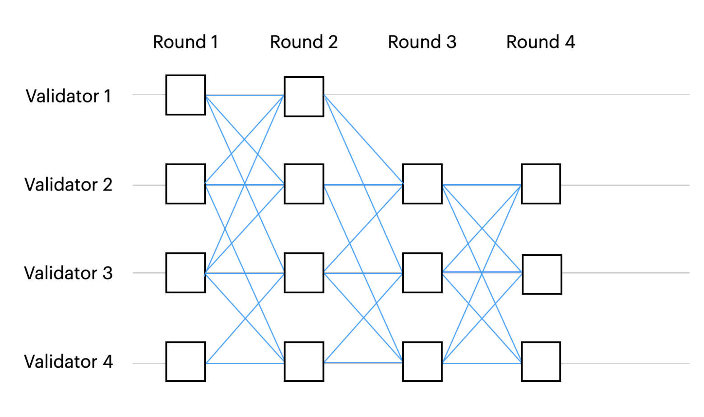

# Consensus mechanism
## Overview
Aleo Network employs a unique consensus mechanism known as AleoBFT to achieve a secure and resilient consensus system with instant finality for block confirmation. This mechanism combines proof-of-stake (POS) to ensure that validators are rewarded for maintaining the overall system integrity and performance.

Aleo Network is run and maintained by three groups of participants:  
- **Stakers** - Delegate staked Aleo Credits (AC) to help onboard more validators and participate in consensus on the Network.  
- **Provers** - Utilize specialized hardware to generate proofs and solve coinbase puzzles, contributing to the security of the network.
- **Validators** - Validate transactions by verifying zero knowledge (ZK) proofs and actively participate in the consensus process on the network.

Check [this FAQs](https://aleo.org/faq/) out in regards of the groups mentioned above.

Everyone can become a staker by locking up their Aleo Credits for a certain period of time to support the security of the Aleo Network. While the minimum amount to stake is 1 AC, stakers will only start earning rewards once they have staked at least 10 ACs. Stakers help lower the barriers to becoming a validator by delegating their stakes to validators of their choice.  

Learn more about **stakers** at [here](). (TODO: redirect to relative docs)  

Provers are required to run specialized GPUs and CPUs to generate solutions in SNARK proofs for PoSW (Proof-of-Succinct-Work) coinbase puzzles. They are rewarded based on their efficiency and effectiveness in generating solutions to the puzzles. It's important to note that provers do not produce blocks, but they are incentivized to improve the process of generating proofs, reducing costs, and decreasing latency for program execution.  

Learn more about **provers** at [here](). (TODO: redirect to relative docs)  

Validators play a crucial role in securing the network through AleoBFT (to be discussed further below) and must have at least 1 million AC of stakes to get started. The main function of validators is to verify ZK proofs and validate transactions before including them in a confirmed block.

Learn more about **validators** at [here](https://aleo.org/faq/). (TODO: redirect to relative docs)  

## AleoBFT
AleoBFT is a new hybrid architecture for consensus. It is a DAG-based BFT protocol inspired by Narwhal and Bullshark. It incentivises validators to preserve network liveness and provers to scale proving capacity for Aleo ecosystem.

AleoBFT guarantees instant finality once validators achieve consensus for each block. With instant finality, not only validators enjoy better node stability but also creates smooth experience for applications developers and users. And this guarantee makes interoperability with other ecosystem simpler.

AleoBFT provers are computing core components of ZK proofs and receive shares of coinbase rewards by solving and producing these coinbase proofs, which is called Proof of Succint Work (PoSW). This incentivise provers to also become a validator themselves by accumulate and stake 1 million ACs. By having broader rewards distribution, it helps Aleo Network to achieve greater proving capacity, further decentralise and scaling Aleo network and fortifies censorship-resistence guarantee.

## Bullshark and Narwhal

### Bullshark
Bullshark is a DAG-based BFT protocol, it separate the network communication layer from the ordering (consensus) logic. Each message contains a set of transactions, and a set of references to previous messages. Together, all the messages form a DAG that keeps growing – a message is a vertex and its references are edges. A vertex can be a proposal and an edge can be a vote.

While different parties may see slightly different DAGs at any point in time due to the asynchronous nature of the network, each validator can still totally (fully) orders all the vertices (blocks) without sending a single extra message by just looking at its local view of the DAG.

The DAG being used here is a round-based DAG, each vertex is associated with round number. Each validator broadcasts one message per round and each message references at least `n−f` messages in previous round. `n` is the total number of validating nodes in the network and `f` is the number of Byzantine nodes. Below shows a diagram of how it looks like with `n = 4` and `f = 1`.

Diagram credits: https://arxiv.org/pdf/2209.05633
